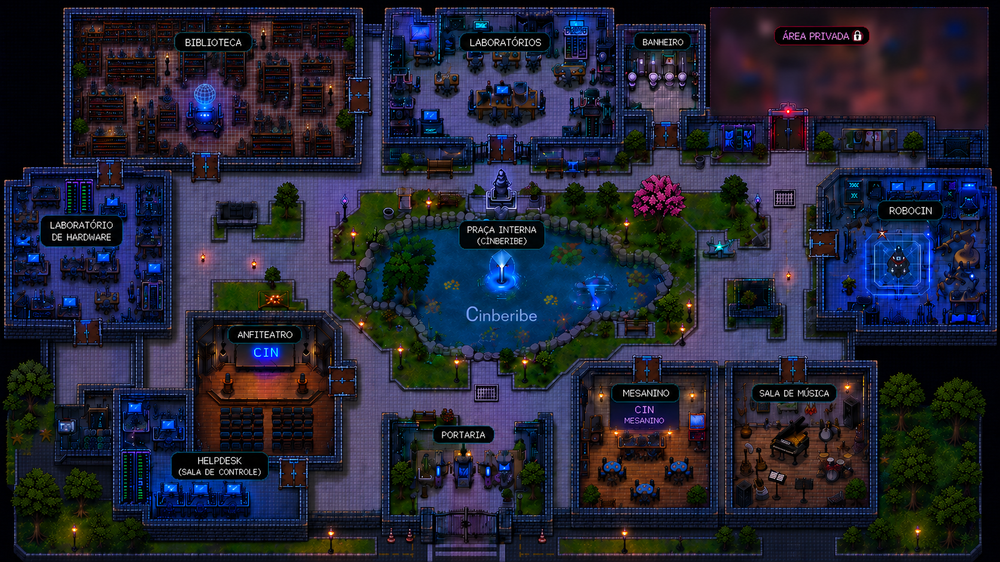

# CInBeribe

## 1. Sinopse:

*Bem-vindo(a) ao Centro de Informática! Assuma o controle de um(a) aluno(a) perdido(a) pelos corredores do CIn e embarque em uma jornada de exploração pelo campus. Para sair, você precisará encontrar três chaves guardadas em salas trancadas — a Biblioteca, o RoboCin, a Sala de Música — e destrancar seu caminho até a saída. Mas cuidado: um vilão ronda os corredores e, se avistar você de perto, vai atrás com tudo. Explore o Hardware, a Área Privada, o Mesanino, o Anfiteatro, o Laboratório, o Helpdesk e até o Banheiro em busca de dicas e kits médicos para recuperar sua vida. Junte as três chaves, escape do perseguidor e prove que você conhece o CIn como a palma da sua mão!*

## 2. Participantes:

* Carlos Roma
* Geraldo Muniz
* Gabriel Justino
* Cassio Freitas
* Glucia Freire
* Juan Henrique

## 3. Arquitetura do Projeto:

O jogo foi desenvolvido com a biblioteca Pygame e estruturado de forma modular, separando responsabilidades em pacotes dedicados a personagens, objetos, cenários, colisões e telas. A estrutura conta com uma pasta `imagem/` para todos os sprites e mapas do jogo, e os seguintes pacotes na raiz:

```text
imagem/
    ├── Imagem_CIn.png                 (fundo do menu)
    ├── mapa.png                       (mapa principal / hub)
    ├── mapa_biblioteca.png
    ├── mapa_lab_de_hardware.png
    ├── mapa_area_privada.png
    ├── mapa_robocin.png
    ├── mapa_sala_de_musica.png
    ├── mapa_mesanino.png
    ├── mapa_anfiteatro.png
    ├── mapa_banheiro.png
    ├── mapa_helpdesk.png
    ├── mapa_laboratorio.png
    ├── chave_vermelha_transparente.png
    ├── chave_azul_transparente.png
    ├── chave_mestra_transparente.png
    ├── kit_medico.png
    ├── pista_transparente.png
    ├── vista_frente.png / vista_costas.png / vista_direita.png / ...   (sprites do jogador)
    └── vilao_frente.png / vilao _costas.png / vilao direita.png / ...  (sprites do vilão)

personagens/
    ├── personagem.py       (classe base)
    ├── boneco.py           (jogador)
    └── vilao.py            (inimigo)

objetos/
    ├── coletavel.py         (classe base dos coletáveis)
    ├── chave.py
    ├── kit_medico.py
    ├── dica.py
    ├── inventario.py
    └── porta.py

mapas/
    ├── mapa.py                (mapa principal / hub)
    ├── biblioteca.py
    ├── hardware.py
    ├── area_privada.py
    ├── robocin.py
    ├── sala_de_musica.py
    ├── mesanino.py
    ├── anfiteatro.py
    ├── banheiro.py
    ├── helpdesk.py
    └── laboratorio.py

colisoes/
    ├── principal.py
    ├── biblioteca_colisao.py
    ├── hardware_colisao.py
    ├── area_privada_colisao.py
    ├── robocin_colisao.py
    ├── sala_de_musica_colisao.py
    ├── mesanino_colisao.py
    ├── anfiteatro_colisao.py
    ├── banheiro_colisao.py
    ├── helpdesk_colisao.py
    └── laboratorio_colisao.py

todas_telas/
    ├── menu.py              (tela inicial)
    └── tela.py              (criação/configuração da janela)

main.py                      (loop principal do jogo)
```

* **main.py:** Controla o loop principal do jogo, gerencia a troca entre os mapas, atualiza personagens, verifica colisões com paredes/objetos/portas e desenha o HUD (vida, chaves, kits, dicas).
* **personagens/personagem.py:** Classe base `Personagem`, responsável por vida, velocidade, posição, limites do mapa e o sistema de dano com cooldown.
* **personagens/boneco.py:** Define o jogador (`Boneco`), controlado pelas teclas direcionais/WASD, com troca de sprite conforme a direção do movimento e verificação de colisão com paredes.
* **personagens/vilao.py:** Define o inimigo (`Inimigo`), que persegue o jogador usando vetores 2D quando ele entra no seu campo de visão, e aplica dano ao encostar nele.
* **objetos/coletavel.py:** Classe base `Coletavel`, com verificação de colisão contra o jogador e detecção de item já coletado.
* **objetos/chave.py, kit_medico.py, dica.py:** Coletáveis específicos (chave, kit médico, dica), cada um com sua própria lógica de desenho e efeito ao ser coletado.
* **objetos/inventario.py:** Gerencia os itens coletados pelo jogador (chaves, kits e dicas) e verifica a condição de vitória.
* **objetos/porta.py:** Controla o sistema de portas trancadas, liberando a passagem apenas quando o jogador possui a chave necessária.
* **mapas/\*.py:** Cada arquivo carrega e desenha a imagem de fundo de um cenário específico do campus.
* **colisoes/\*.py:** Definem os retângulos de colisão (paredes e obstáculos) de cada cenário, usados para bloquear o movimento do jogador.
* **todas_telas/menu.py:** Gera a tela inicial do jogo, com o título "CInBeribe" e o botão para iniciar a partida.
* **todas_telas/tela.py:** Centraliza a criação e configuração da janela do jogo.

## 4. Capturas de Tela:

*Mapa principal (hub que conecta todas as salas do CIn):*



*Tela inicial do jogo:*

O menu exibe o título **"CInBeribe"** sobre a imagem do prédio do CIn (`imagem/Imagem_CIn.png`), com um botão vermelho "Começar" para dar início à exploração.

## 5. Ferramentas, bibliotecas e frameworks utilizados:

* Python 3.
* **Biblioteca Pygame:** Biblioteca principal utilizada para a construção do jogo, responsável pela criação da janela e do loop principal, pela captura de eventos de teclado e mouse, pela renderização das imagens e formas geométricas (mapas, sprites, HUD) e pelo gerenciamento das entidades do jogo através de `pygame.Rect` para colisões e `pygame.math.Vector2` para a movimentação do vilão.
* **Git e GitHub:** Usados para versionamento de código, criação de branches por funcionalidade (ex: `feat/coletaveis-no-mapa`, `feat/funcionalidades-basicas`) e Pull Requests, mantendo o código seguro durante o trabalho em equipe.
* **VS Code:** Editor de código utilizado para o desenvolvimento do projeto, facilitando a navegação entre os múltiplos módulos (personagens, objetos, mapas, colisões) e a identificação de erros de sintaxe durante a codificação.
* Imagens dos mapas e sprites do jogador/vilão desenhadas especificamente para representar os ambientes reais do Centro de Informática.

## 6. Divisão de trabalho:

*

## 7. Conceitos de Programação utilizados:

Durante o desenvolvimento do projeto, diversos conceitos estudados na disciplina foram aplicados na prática:

* **Programação Orientada a Objetos (POO):** O sistema foi estruturado em classes (`Personagem`, `Boneco`, `Inimigo`, `Coletavel`, `Chave`, `KitMedico`, `Dica`, `Inventario`, `Porta`), cada uma encapsulando seus próprios atributos e métodos.
* **Herança:** Aplicada nas classes `Boneco` e `Inimigo`, que herdam de `Personagem` (reaproveitando vida, velocidade, limites de mapa e sistema de dano), e nas classes `Chave`, `KitMedico` e `Dica`, que herdam de `Coletavel` (reaproveitando a lógica de posição e verificação de colisão).
* **Polimorfismo:** O método `desenhar()` é sobrescrito de forma diferente em cada subclasse de `Coletavel`, permitindo que o jogo trate todos os itens coletáveis de forma uniforme, mesmo com aparências e comportamentos distintos.
* **Comandos Condicionais:** Uso extensivo de `if/elif/else` para tomada de decisão, como na detecção de qual tecla está pressionada em `Boneco.movimento()`, na checagem de colisão com paredes e portas, e na lógica de `Inimigo.perseguir()` que decide se o vilão persegue o jogador com base na distância.
* **Laços de repetição:** Uso de `for` para desenhar os corações de vida na HUD, iterar sobre as listas de chaves/kits/dicas de cada mapa e percorrer os eventos do Pygame a cada frame; uso de `while` para implementar o loop principal do jogo (`while flag_rodar`) e o loop do menu inicial.
* **Listas:** Utilizadas para armazenar as chaves (`lista_chaves`), kits médicos (`lista_kits`) e dicas (`lista_dicas`) espalhados pelos mapas, além do inventário do jogador (`inventario.chaves`, `inventario.kits`, `inventario.dicas`) e do histórico de dicas exibido na tela.
* **Dicionários:** Utilizados em `main.py` para mapear o nome de cada cenário (string) à sua respectiva função de desenho (ex: `{"biblioteca": biblioteca.desenhar, "robocin": robocin.desenhar, ...}`), permitindo alternar entre mapas de forma dinâmica.
* **Máquina de Estados:** Implementada através da variável `mapa_atual`, que controla qual cenário está ativo e é atualizada sempre que o jogador colide com uma porta, alternando entre o mapa principal e as salas do campus.
* **Vetores e Matemática Aplicada:** Uso de `pygame.math.Vector2` na classe `Inimigo` para calcular a direção entre o vilão e o jogador, normalizando o vetor para manter uma velocidade de perseguição constante.
* **Controle de Tempo (Cooldown):** Uso de `pygame.time.get_ticks()` na classe `Personagem` para evitar que o jogador sofra dano contínuo do vilão, aplicando um intervalo mínimo entre ataques.
* **Geometria Computacional e Colisões:** Aplicação prática da classe `pygame.Rect`, calculando a sobreposição de hitboxes para detectar interações entre o jogador, o vilão, as paredes dos cenários, os coletáveis e as portas.
* **Flags booleanas:** Uso de variáveis como `flag_rodar` e `pegou` para controlar o estado de execução do jogo e evitar que um mesmo item seja coletado mais de uma vez.

## 8. Aprendizados e Desafios:

* *Qual foi o maior erro cometido durante o projeto? Como vocês lidaram com ele?*
   

O maior erro foi não ter começado a estruturar o projeto em POO, pois futuramente tivemos que trocar todas as partes que não estavam em POO para POO de maneira definitiva (usando classes e suas características). Mas conseguimos lidar bem com toda essa transição, sem muitas dificuldades.


* *Qual foi o maior desafio enfrentado durante o projeto? Como vocês lidaram com ele?*
   

O maior desafio foram os mínimos detalhes, quando vai chegando perto do final e algo persiste a não ficar do jeito esperado. Lidamos de maneira positiva, com muita resiliência.


* *Quais as lições aprendidas durante o projeto?*
   

Sempre definir, antes de tudo, o que vai ser utilizado e o que não vai no projeto (tecnologias e seus métodos), para não ficar trocando a lógica de partes do código que poderiam ser feitas de maneira mais sólida anteriormente.


## 9. Como jogar:

* *Requisitos:*
    * Python 3.x instalado.
    * Pygame instalado (rode `pip install pygame` no terminal).

* *Mecânicas do jogo*

  * O jogador começa com 3 pontos de vida (corações) na sala principal do CIn e precisa explorar o campus em busca das três chaves — Vermelha, Azul e Mestra — para destrancar as salas e escapar. Utilize as **setas do teclado** (ou **WASD**) para se movimentar entre as salas.

   * *Coletáveis*
       * 🔑 Chaves (Vermelha, Azul e Mestra): abrem portas específicas do campus. A Chave Vermelha é encontrada na Sala de Música, a Chave Azul na Área Privada e a Chave Mestra no RoboCin.
       * 💊 Kit Médico: recupera 1 ponto de vida (até o máximo de 3 corações). Espalhados pelo mapa principal, Biblioteca, Hardware, RoboCin e Sala de Música.
       * 💡 Dica: revela uma pista sobre a localização de uma das chaves, exibida na tela e salva no histórico de dicas.

   * *Perigos*
       * 👤 O Vilão: ronda o campus e, ao detectar o jogador a até 300 pixels de distância, inicia perseguição. Encostar nele causa dano, com um pequeno intervalo de proteção entre cada ataque.

   * *Portas*
       * 🚪 Algumas salas exigem a chave correta para serem acessadas. Tentar passar sem a chave necessária bloqueia a passagem e exibe uma mensagem na tela.

   * Explore todas as salas do CIn — Biblioteca, Hardware, Área Privada, RoboCin, Sala de Música, Mesanino, Anfiteatro, Banheiro, Helpdesk e Laboratório —, colete as três chaves, cuide da sua vida e escape do vilão!

* *Instruções:*
    * Clone ou baixe o código no repositório oficial: https://github.com/GeraldoMuniz/ProjetoIP
    * Instale a dependência do projeto: `pip install pygame`
    * Rode o arquivo `main.py`.

# BOM JOGO E BOA SORTE PELOS CORREDORES DO CIn! 
